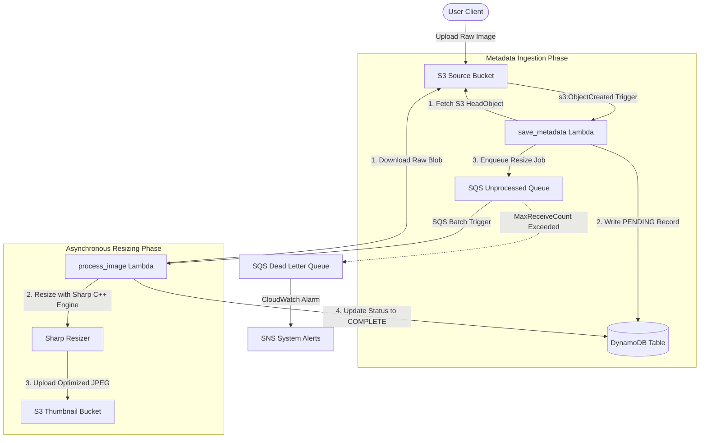

# Image Processing Matrix

[](https://github.com/nadav-alon/image-processor/actions/workflows/ci.yml)

> **Small scale, AWS deployed image to thumbnail processing unit**

An event-driven, serverless pipeline deployed on AWS to asynchronously convert raw image uploads into optimized thumbnails. The architecture decouples the metadata indexing from the image processing stage using SQS messaging, ensuring scalability, resilience, and strict fault tolerance with built-in dead-letter queue (DLQ) routing.

The project is complete with an AI generated frontend client, a dependency-free native unit testing suite, and an end-to-end LocalStack integration test harness that programmatically validates the entire infrastructure in a mock local environment.

---

## Architecture Overview



## Tech Stack

* **Infrastructure as Code**: Terraform (~> 6.0 AWS Provider)
* **Backend Runtime**: Node.js (ESM, `nodejs24.x`)
* **Image Processor**: `sharp`
* **Database**: Amazon DynamoDB
* **Messaging**: Amazon SQS
* **Storage**: Amazon S3 
* **Testing & Mocks**: Native Node.js test runner (`node:test`, `node:assert`)
* **Local Development**: LocalStack (Local AWS Cloud Emulator)

---

## Getting Started (Local Development)

This repository is optimized to run entirely on your local machine using **LocalStack** to emulate AWS.

### Prerequisites
1. **Docker Desktop** (with WSL2 integration enabled if on Windows).
2. **LocalStack CLI** (`pip install localstack` or binary download).
3. **Terraform CLI** (v1.2+).
4. **Node.js** (v24.x recommended).

### 1. Start LocalStack
Spin up the local cloud emulator in the background:
```bash
localstack start -d
```
Verify that the services are online by running `localstack status`.

### 2. Run the Native Unit Tests
Unit tests run using Node's native test runner (no Jest or Mocha dependencies required):
```bash
# Install dependencies in the lambda function directory
cd src
npm install
npm run test
cd ..
```

### 3. Run the End-to-End Integration Test
The E2E suite automates the entire developer pipeline:
1. Validates connection to the running LocalStack daemon.
2. Programmatically initializes and applies the **Terraform** configuration.
3. Automatically discovers bucket suffixes and resource URLs.
4. **Test 1 (Happy Path)**: Uploads image.jpg, polls the S3 Thumbnail bucket, and verifies DynamoDB updates to `COMPLETE`.
5. **Test 2 (DLQ Redrive)**: Uploads a corrupted binary blob, verifies processing failure, and validates routing to the SQS Dead Letter Queue (DLQ).

Run the E2E script from the root directory:
```bash
# Install the E2E testing dependencies in the root
npm install

# Run the integration test suite
npm run test:integration
```

---

## Frontend Gallery Client

The project includes a client for interacting with the S3 pipeline. Note that this client is for local development only, and has some security issues that would need to be addressed if it were to be used for production.

### How to use:
1. Ensure the infrastructure is deployed (via `terraform apply` or by running the E2E script), which automatically generates `config.js` containing the dynamically-generated bucket endpoints.
2. Open the [index.html](file:///home/cowclaw/image-processor/index.html) file directly in any modern browser or host it via a local web server (e.g. `python3 -m http.server 3000`). The client will automatically load the active endpoints.
3. Drag and drop any image matrix file into the interactive zone to inject it into S3.
4. Click **Query Matrix** to fetch complete thumbnails and view high-resolution originals inside the built-in lightbox.
